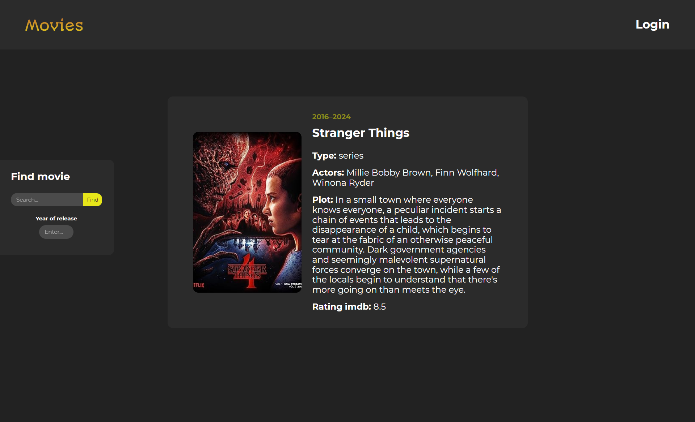

## Скриншот программы

## О приложении

Movies - это приложение которое отображает фильм в зависимости от заданного названия (Дополнительно можно указать год выпуска).

## Функции программы

- Поиск фильмов:
  - Постер
  - Год выпуска
  - Название
  - Тип
  - Актёры
  - Сюжет
  - Рейтинг

## Технологии

- HTML
- CSS
- JavaScript
- React

## Ссылки

Демонстрация - [Movies](https://kustiche.github.io/ReactProjectMovies/)
